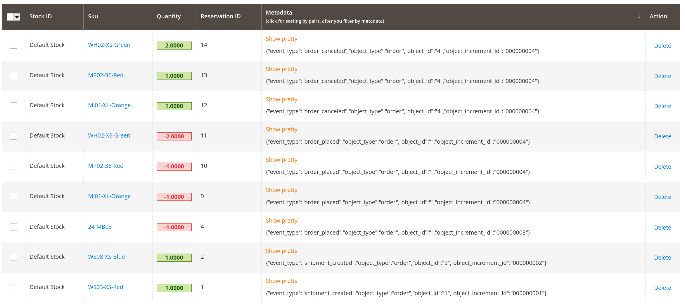
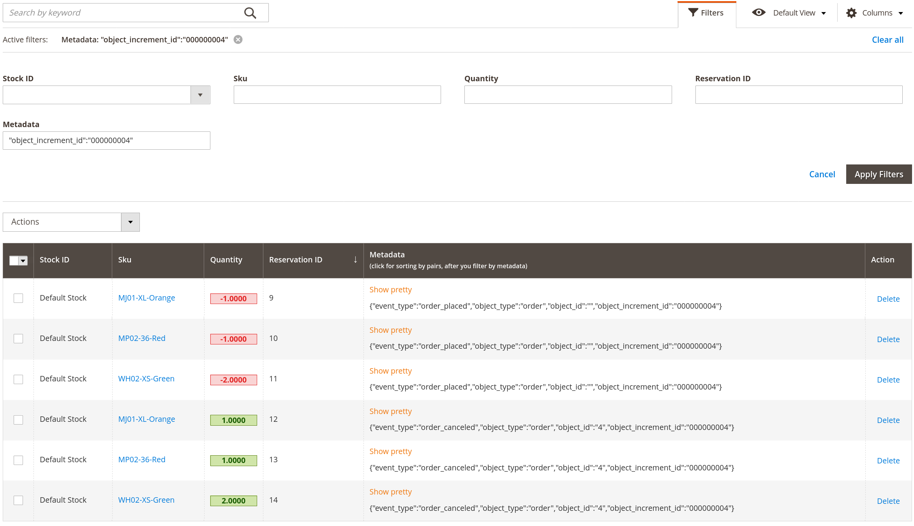

# Reservation Admin

It helps to find and manipulate the product's reservations.

## Additional Links

- [About Magento 2 Template](./docs/magento.md)
- [Inventory Reservation](./docs/inventory.md)
- [PHPCS](./docs/phpcs.md)

## Magento 2 version

### 2.4.3-p1

## Reservation

You can find product reservation data in the menu: **Stores > Reservation > Products**


After you clicked on that you will see default grid view:



## Filters

Of course, you have ability to filter data.

Let's look, for instance, filter by Orders. Just click on default button "Filter":


And here you will see the filter by "Metadata" column:


I kept the text field as is because it is more flexible for search.

At first, look at basic possible metadata values:

*New order was placed*:

```json
{
    "event_type": "order_placed",
    "object_type": "order",
    "object_id": "",
    "object_increment_id": "000000003"
}
```

*Shipment already created for order*:

```json
{
    "event_type": "shipment_created",
    "object_type": "order",
    "object_id": "1",
    "object_increment_id": "000000001"
}
```

*Order was canceled*:

```json
{
    "event_type": "order_canceled",
    "object_type": "order",
    "object_id": "3",
    "object_increment_id": "000000003"
}
```

As you can see, here `"object_increment_id"` contains order id in the case when `"object_type"` equals `"order"`.

Metadata always has written in one line without spaces or newline characters:

```json
{"event_type":"order_canceled","object_type":"order","object_id":"3","object_increment_id":"000000003"}
```

Therefore, you can find easily what you want:



Also, you can combine filters:


If you need information by pairs positive-negative, you should filter by "Metadata" and click on "Metadata" column for sort by pairs:


Button "Show pretty/raw" changes the JSON metadata view:


